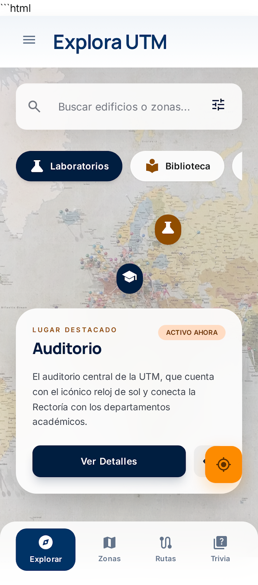
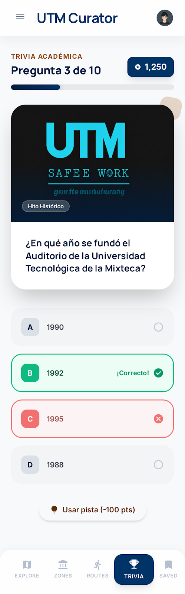

# Explora UTM

**Explora UTM** es una aplicación móvil interactiva diseñada para guiar a los estudiantes de nuevo ingreso a través del campus de la Universidad Tecnológica de la Mixteca. La app combina navegación GPS, información detallada de edificios y dinámicas lúdicas para facilitar la adaptación al entorno universitario.

## Integrantes:
* **Jose Pavel Cayetano Lopez**.

## Tecnologías a Utilizar
* **Framework:** [Flutter](https://flutter.dev/) (Dart).
* **Mapas:** [Google Maps SDK for Flutter](https://pub.dev/packages/google_maps_flutter) o [Flutter Map](https://pub.dev/packages/flutter_map).
* **Geolocalización:** [Geolocator](https://pub.dev/packages/geolocator) para ubicación en tiempo real.
* **Estado:** [Provider](https://pub.dev/packages/provider) o [Riverpod].
* **Almacenamiento:** Firebase para datos dinámicos de los puntos de interés.

## Prototipo de Pantallas

A continuación se describen las pantallas principales del prototipo actual:

1.  **Pantalla de Exploración (Home):** Un mapa interactivo con filtros rápidos (Laboratorios, Biblioteca) y una tarjeta de "Lugar Destacado" (como la Explanada Principal) que muestra eventos activos.
2.  **Zonas y Actividades Cercanas:** Lista categorizada de edificios según su función (Zona Académica Sur, Tech Zone). Permite ver la distancia en metros desde la ubicación actual.
3.  **Detalle del Lugar (Place Details):** Información extendida que incluye descripción arquitectónica, horarios de atención, datos curiosos ("Fun Facts") y una galería visual.
4.  **Rutas y Senderos:** Sugerencias de recorridos dentro del campus, como el "Circuito Deportivo" o el camino al "Mirador del Atardecer", indicando tiempo estimado y dificultad.

### Bocetos de la Aplicación

## Actividades o Juegos:

* **[Trivia academica]:** Ubicado en la carpeta `/propuesta/trivia-pavel/`.